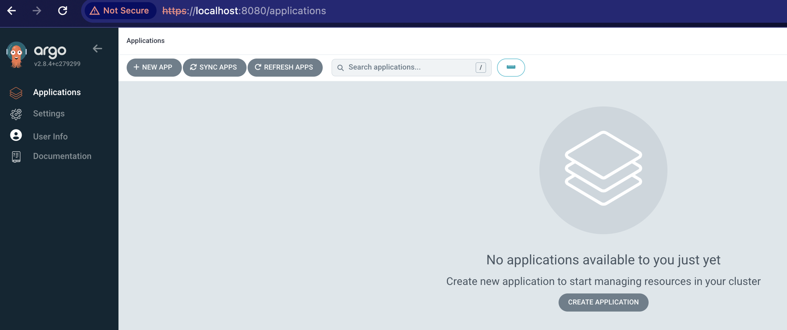

# About
This repo contains documentation, scripts and resources for:

1) spinning up kubernetes locally
2) installing ArgoCD into that locally running kubernetes cluster

# Installing

This script is doing what [you'd otherwise just do manually](./manualInstructions.md)

We try to document this process, but also provide a convenience `Makefile` so you can just run:

`make install`

to get kind, k9s and argo installed/working on your machine (provided it's a mac. Sorry)

Hopefully if there are errors, they should be meaningful. If all is well, the output will end with someething like:
```bash
****************** getting ArgoCD credentials ******************
Argo pwd is abc123
```

Which means the `admin` argo account has password `abc123` (which will be different for your install).

# Loggin in 

Having previously run the install above, you can then run:

`make login`

which should "port-forward" from localhost to the argo host running in docker.

The output should end with:
```bash
=============================================
You can open argo at https://localhost:8080
=============================================
```

So you can hopefully open a browser and log in using the credentials 'admin' w/ the password output from `make login`:
```bash
****************** getting ArgoCD credentials ******************
Argo pwd is TP56Mr7M96AyEJm5
```



Congrats! from here, other [Kind Service](https://www.kindservices.co.uk) will offer helper scripts to install themselves with argocd
